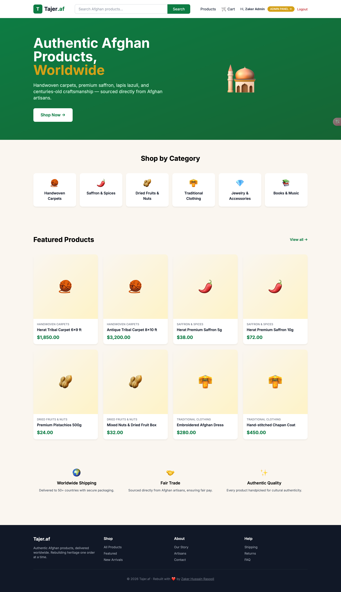
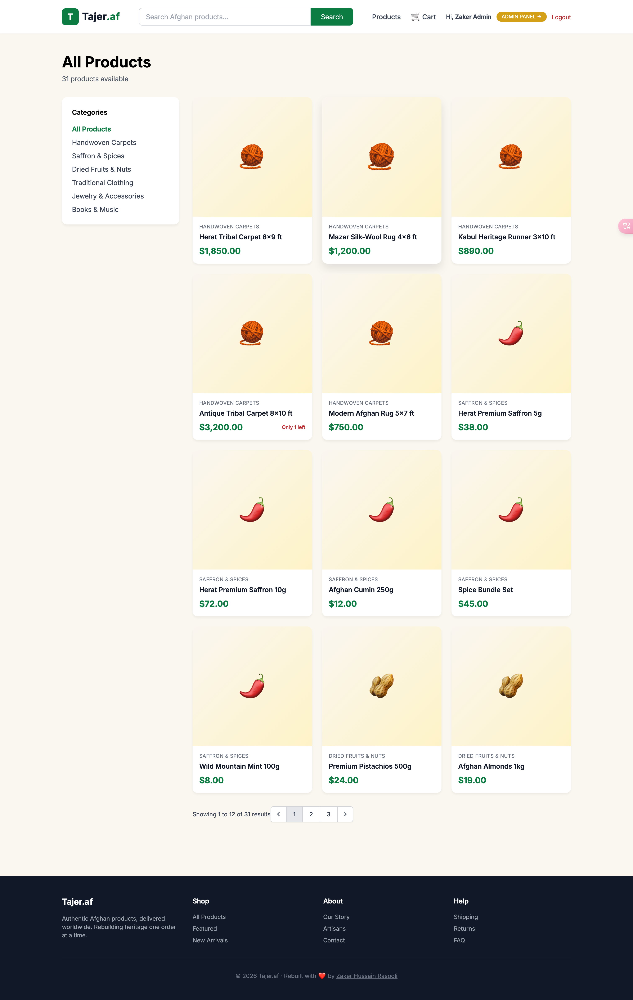
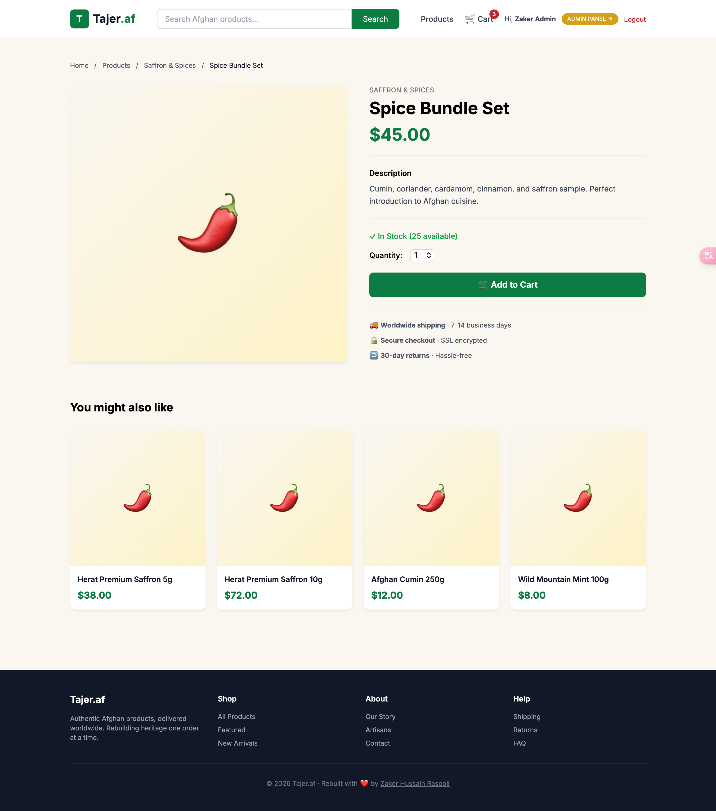
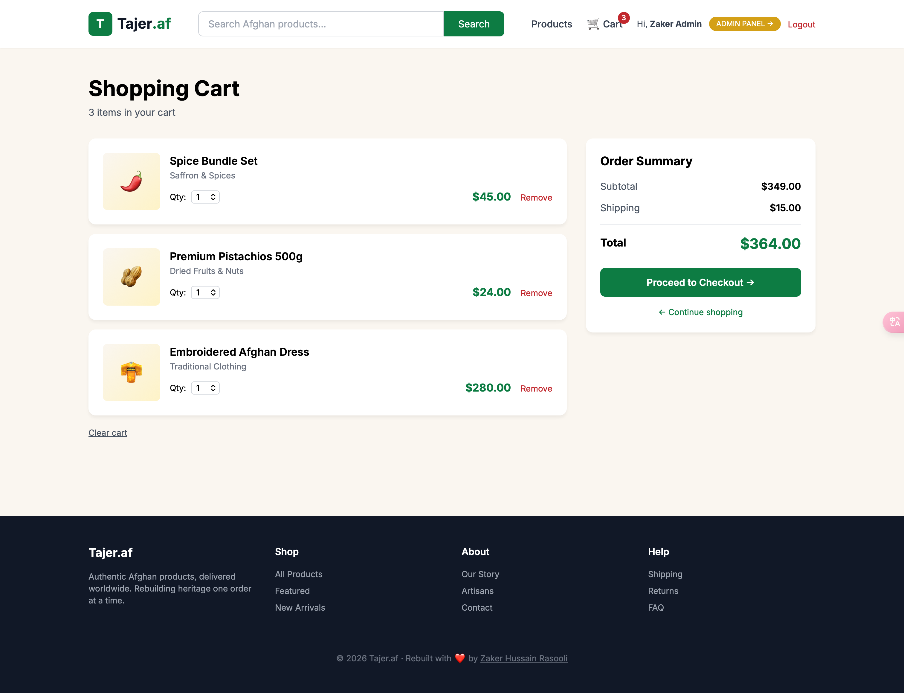
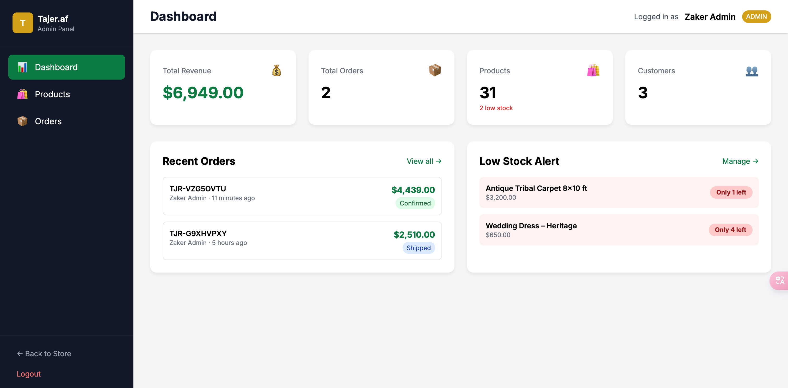
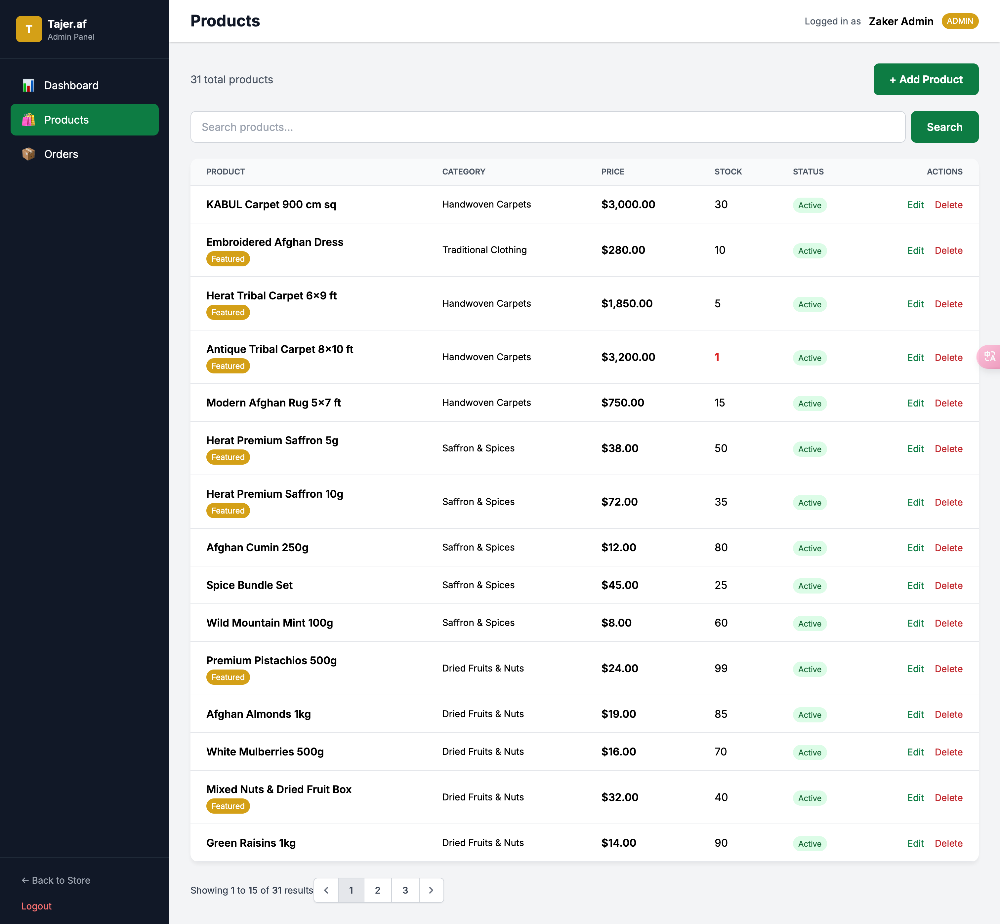

# 🛍️ Tajer.af v2

> **A modern full-stack e-commerce platform for authentic Afghan products — built with Laravel 11, MySQL, and Tailwind CSS.**

This is the modern rebuild of [Tajer.af](https://www.facebook.com/Tajer.af/), my original e-commerce platform that I founded and ran in Kabul, Afghanistan from 2017 to 2022 before displacement. This v2 reconstruction demonstrates my full-stack engineering capabilities using a current technology stack.


---

## 📸 Screenshots

### 🏠 Homepage


### 🛍️ Product Catalog


### 📦 Product Detail Page


### 🛒 Shopping Cart


### 📊 Admin Dashboard


### 🛠️ Admin Product Management


---

## ✨ Features

### Customer-Facing
- 🏠 **Beautiful storefront** with hero, categories, and featured products
- 🔍 **Product search and filtering** by category and keyword
- 📦 **Product detail pages** with stock indicators, related products, and rich descriptions
- 🛒 **Persistent shopping cart** with quantity updates and live total calculation
- 💳 **Multi-step checkout** with shipping address and order confirmation
- 🔐 **User registration and authentication** powered by Laravel Breeze
- 📱 **Fully responsive design** that works on mobile, tablet, and desktop

### Admin Panel
- 🔒 **Role-based access control** — only admin users can access /admin
- 📊 **Dashboard with KPIs** — revenue, orders, customers, low-stock alerts
- 🛍️ **Full product CRUD** — create, read, update, delete products with category assignment
- 📦 **Order management** — view, filter by status, update order status
- 📈 **Recent orders feed** and low-stock product alerts on dashboard
- 👤 **Customer overview** linked to orders

### Technical
- ⚡ **Laravel 11** modern framework architecture
- 🗄️ **Eloquent ORM** with proper relationships (Products ↔ Categories, Users ↔ Orders)
- 🔐 **Session-based authentication** with secure password hashing
- 🎨 **Tailwind CSS 3** custom design system with brand colors
- 🚀 **Vite** for lightning-fast asset bundling
- 💾 **MySQL 8** with proper foreign keys, cascade deletes, and indexed slugs
- 🌱 **Database seeders** for instant demo data (30 products, 6 categories, 2 users)

---

## 🛠️ Tech Stack

| Layer | Technology |
|---|---|
| **Backend** | PHP 8.4, Laravel 11 |
| **Frontend** | Blade templates, Tailwind CSS 3, Alpine.js |
| **Database** | MySQL 8 |
| **Auth** | Laravel Breeze |
| **Asset Bundling** | Vite |
| **Version Control** | Git + GitHub |

---

## 🚀 Getting Started

### Prerequisites

You'll need these installed:
- PHP 8.4+
- Composer 2.x
- Node.js 20+
- MySQL 8+

### Installation

1. **Clone the repository**
```bash
   git clone https://github.com/zrasooli94/tajer-af-v2.git
   cd tajer-af-v2
```

2. **Install PHP dependencies**
```bash
   composer install
```

3. **Install Node dependencies**
```bash
   npm install
```

4. **Set up environment**
```bash
   cp .env.example .env
   php artisan key:generate
```

5. **Configure your database** in `.env`
```env
   DB_DATABASE=tajer_af_v2
   DB_USERNAME=root
   DB_PASSWORD=your_password
```

6. **Run migrations and seeders**
```bash
   php artisan migrate
   php artisan db:seed
```

7. **Build frontend assets**
```bash
   npm run build
```

8. **Start the development server**
```bash
   php artisan serve
```

9. **In a second terminal, start the Vite dev server** (for hot reload during development)
```bash
   npm run dev
```

10. **Open in browser**

http://localhost:8000

---

## 👤 Demo Accounts

After running seeders, two demo accounts are available:

| Role | Email | Password |
|---|---|---|
| 👑 Admin | `admin@tajer.af` | `admin123` |
| 👤 Customer | `demo@tajer.af` | `demo123` |

Log in as **admin** to access the `/admin` dashboard.

---

## 📁 Project Structure
```
tajer-af-v2/
├── app/
│   ├── Http/
│   │   ├── Controllers/
│   │   │   ├── Admin/           # Admin panel controllers
│   │   │   ├── Auth/            # Authentication (Breeze)
│   │   │   ├── CartController.php
│   │   │   ├── CategoryController.php
│   │   │   ├── CheckoutController.php
│   │   │   ├── HomeController.php
│   │   │   └── ProductController.php
│   │   └── Middleware/
│   │       └── AdminMiddleware.php
│   └── Models/
│       ├── Category.php
│       ├── Product.php
│       ├── CartItem.php
│       ├── Order.php
│       └── User.php
├── database/
│   ├── migrations/              # Schema definitions
│   └── seeders/                 # Demo data
├── resources/
│   ├── css/app.css              # Tailwind + custom styles
│   └── views/
│       ├── admin/               # Admin panel views
│       ├── auth/                # Login, register
│       ├── cart/, checkout/     # Shopping flow
│       ├── products/, categories/  # Public storefront
│       └── layout.blade.php     # Master layout
└── routes/
├── web.php                  # All application routes
└── auth.php                 # Breeze auth routes
```
---

## 🎨 Design System

Custom Tailwind brand colors:

| Token | Hex | Purpose |
|---|---|---|
| `tajer-green` | `#0d7c43` | Primary brand color |
| `tajer-red` | `#c1272d` | Alerts, sale tags |
| `tajer-gold` | `#d4a017` | Admin badge, featured items |
| `tajer-cream` | `#faf6f0` | Soft background |

---

## 🗺️ Roadmap

Future enhancements I'd like to add:

- [ ] Stripe payment integration (currently demo checkout only)
- [ ] Product image uploads (Cloudinary integration)
- [ ] Bilingual UI (English + Dari)
- [ ] Email order confirmations (Mailgun)
- [ ] Persistent cart across logout/login
- [ ] Product reviews and ratings
- [ ] Wishlist functionality
- [ ] Admin sales analytics with charts

---

## 📖 About the Original Tajer.af

The original Tajer.af was one of Afghanistan's early e-commerce platforms, founded in Kabul in 2017 and operated until 2022. The platform served Afghan businesses and consumers with product listings, order management, and digital payments — built solo using PHP (Laravel), MySQL, and JavaScript. Following displacement from Afghanistan in 2022, the platform was abandoned.

This v2 reconstruction was built in 2026 as a portfolio project to demonstrate modern full-stack engineering capabilities and to honor the original work. While the visual design and feature set have been significantly modernized, the core mission — making Afghan craftsmanship accessible worldwide — remains.

---

## 👨‍💻 About the Developer

**Zaker Hussain Rasooli** — Full-Stack Developer with 8+ years of experience building web applications.

- 🌐 [LinkedIn](https://www.linkedin.com/in/zaker-rasooli94/)
- 🐙 [GitHub](https://github.com/zrasooli94)
- 📍 Kuala Lumpur, Malaysia (open to relocation to Australia)


---

## 📄 License

This project is open source under the [MIT License](LICENSE).

---

<p align="center">
  Built with ❤️ by <a href="https://github.com/zrasooli94">Zaker Hussain Rasooli</a> · Rebuilt from displacement, with a vision for the future.
</p>